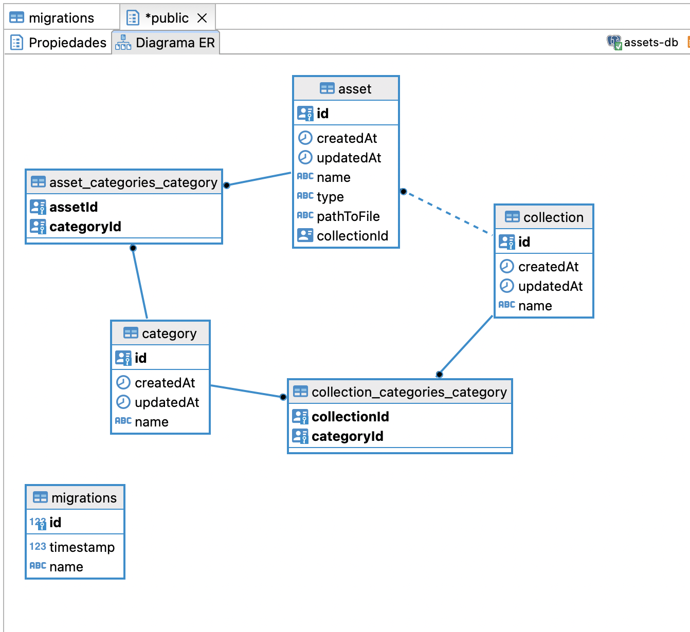

# node-express-assets

## Theory

1. Model, Relations and System Representation:
   
   
   I considered this approaches but other approach could be implemented like adding a Category (CollectionCategory) entity for the Collection and other Category to the Asset (AssetCategory) in case the business require it.
2. My solution will be based on an Event Driven Architecture with 3 microservices to ensure the scalability of the system making it more modular and performant.

3. I rejected the Monolithic Schema, due to its less performant and efficient. But for early stages of a project with low demand could be a good solution to reduce the complexity of the project. Considering always to reduce the coupling between models and services, in case its necessary in the future to move the service to a microservice and run it separately.

4. Read and write optimized model:

   a. Read: For this approach the focus is to optimize the system to perform fast read of the data when it involve complex queries. To do this for example we can implement a data warehouse to store result of frequently used queries.

   b. Write: For this approach the focus is to optimize the system to be able to write a high volume of incoming data. To do this we can make our data schema more simplified by reducing the joins and indexes for example.

   Also we can consider to have a read or write microservice for Assets in case we have a high volume request of read or write.

## Practice

## Steps to run the project:

```bash
$ git clone https://github.com/danielhdezller/node-express-assets.git
```

- First copy `.env.sample` to `.env` at the project folder level.
- Set the env variable APP_MODE as dev or prod.
- Then follow:

```bash
$ cd ./project
$ npm i
$ docker-compose up
$ npm run typeorm migration:run
# For development:
$ npm run dev
# For production:
$ npm run build && npm run start
```

## Steps to run the project:

- if you haven't already: copy `.env.sample` to `.env` at the project folder level.
- Set the env variable APP_MODE as test

```bash
$ cd ./project
$ npm i
# To start de testing postgres DB
$ docker-compose up
$ npm run test
```

### Swagger documentation at:

http://localhost:3001/api-docs/

## Stay in touch

- Author - [Daniel Hernández](https://github.com/danielhdezller)
- LinkedIn - [LinkedIn](https://www.linkedin.com/in/daniel-hernandez-ller/)
