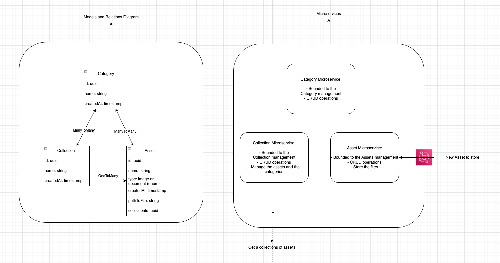

# node-express-assets

## Theory

1. Model, Relations and System Representation
   
2. My solution will be based on an Event Driven Architecture with 3 microservices to ensure the scalability of the system making it more modular and performant.
3. I rejected the Monolithic Schema, due to its less performant and efficient.
4. Read and write optimized model:

   a. Read: For this approach the focus is to optimize the system to perform fast read of the data when it involve complex queries. To do this for example we can implement a data warehouse to store result of frequently used queries.

   b. Write: For this approach the focus is to optimize the system to be able to write a high volume of incoming data. To do this we can make our data schema more simplified by reducing the joins and indexes for example.

## Practice
